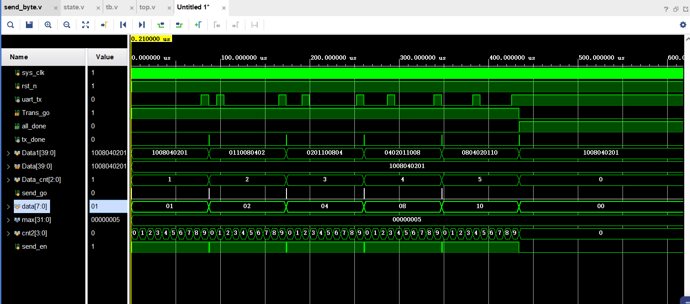
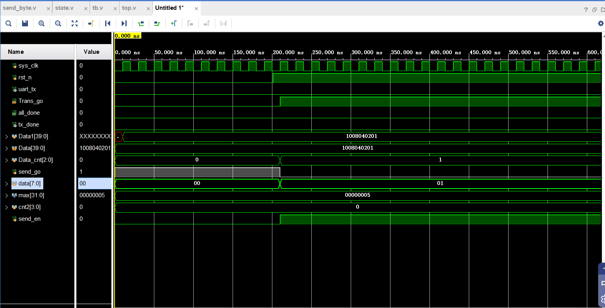

@[toc](用串口发送多bit数据)

# 一、想实现的效果是

当外部给了一个40bit 的数据，FPGA芯片可以用串口把它发给电脑上，或者其他地方，这个我不是很清楚。接收端设备通常是指接收计算机发送的数据的设备。例如，在计算机和FPGA芯片之间进行数据传输时，接收端设备可以是FPGA芯片。

发送端设备通常是指将数据发送给计算机的设备。例如，在计算机和FPGA芯片之间进行数据传输时，发送端设备可以是计算机。

在计算机和FPGA芯片之间进行数据传输时，发送端设备将数据发送到串口，然后通过串口发送协议将数据发送到接收端设备。接收端设备通过串口接收协议接收数据，并将其处理后显示在计算机上。

# 二、使用两个状态来控制传输__实现思路

## 1. 设计思想

如果继续通过划分Data来充当做状态的的话，以后发的数据如果不是40位，而是80bit 那Data的位宽需要改动，state的值也要改动，并且state的值还会变得更多，好麻烦呀。
如果发完一组8bit ，不用听从state的指令，而是直接自动地继续发后边的信号，那就好了。又因为在串口模块里，每当8 bit 数据发送完毕就会有一个tx_done信号。只要让
state=0，当tx_done=1的时候，state+1，这样就可以自动地发送后边的信号了。

==具体就是==：

## 2. 端口介绍

* 其中的端口以及变量的含义是：


| 端口 |  含义   |
|:----------------| :-------------|
信号发送部分 **send_byte** | 通过send_byte模块实现，该模块用于将数据通过串行方式发送。
数据计数器 **Data_cnt** | 用于记录发送的数据个数。当计数器达到最大值时，需要清0。 
 数据缓存 **Data1** |  用于存储待发送的数据。当发送完成后，需要将数据移位
发送控制 **send_go** | 用于控制数据的发送过程。当接收到发送请求时，根据计数器值和发送完成状态决定是否继续发送。
发送完成标志 **tx_done**|用于记录发送是否完成。
数据发送状态 **data**|根据发送控制状态决定发送的数据。
发送完成状态 **all_done**|用于记录所有数据发送完成的状态。
  
## 3. 过程描述

* 当**rst_n**拉低时，**Trans_go**信号默认为低，当rst_n拉高后，**Trans_go**拉高，进入到发送状态。
  **send_go**默认为高。当Trans_go为高时，进入发送数据状态。send_go这时会有一个高脉冲，当send_go为1时，send_byte模块（串口模块）开始发送8bit数据。第一次的8bit数据发送完，会有一个tx_down信号拉高。
  而当**tx_down**信号拉高的时候，**Data_cnt**会+1,同时**Data1**会循环往左移8bit，同时，**data**又被赋予新一次的Data1[7:0]。直到**Data_cnt**达到最大字节（对于40bit的数据来说，最大字节值为5），**send_go**信号不再拉高，**send_byte**模块停止发送。同时**all_done**信号拉高，表示数据发送完成。**Trans_go**信号拉低。

* 为什么要把Data的值传给Data1？
  * 因为Data1是用于存储待发送的数据，当发送完成后，需要将数据移位。而Data是用于存储当前要发送的数据，当发送完成后，需要将Data的值传给Data1，以便下一次发送。
* 为什么要设置一个Data_cnt来存储发送到哪一个字节了？
  * 因为发送数据时，需要知道当前发送到哪一个字节了，以便在发送完成后，将数据移位。同时，当发送到最大字节时，需要停止发送，并将**all_done**信号拉高，表示数据发送完成。
* send_go信号的作用是什么？
  * send_go信号用于控制数据的发送过程。当接收到发送请求时，根据计数器值和发送完成状态决定是否继续发送。当send_go为1时，send_byte模块开始发送8bit数据。当send_go为0时，send_byte模块停止发送。

# 三、传输 40bit 的代码

## 1. 方案代码

* **send_byte.v 串口代码**  

```verilog
   module send_byte (                           
input sys_clk         ,          
input rst_n           ,          
input [2:0] time_set  ,   //Baud rate setting      
input [7:0] data      ,          
input send_go         ,          
output reg uart_tx    ,          
output reg tx_done  
    );
/*-----------------------parameter declaration -----------------------------*/
reg [31:0] cnt;// the basic cnt
reg [3:0] cnt2;//Two-stage counter 
reg [31:0] time_cnt;
reg send_en;
reg [7:0] r_data;
/*-----------------------Baud rate setting -----------------------------*/ 
always@(*)
    if(!rst_n)
        time_cnt<=434;
    else
        case(time_set)  
            0:time_cnt<=10416;                 //4800; 
            1:time_cnt<=5208;                  //9600; 
            2:time_cnt<=434;                   //115200;
            default:time_cnt<=434;             //115200; 
        endcase
/*-----------------------r_data-------------------------------*/
always @(posedge sys_clk) begin
    if(!rst_n)
        r_data<=1'b1;
    else if (send_go)
        r_data<=data;
    else
        r_data<=r_data;
end
/*-----------------------send_en-------------------------------*/
always @(posedge sys_clk or negedge rst_n) begin
    if(!rst_n)
        send_en<=32'd0;
    else if(send_go)
        send_en<=1;
    else if (tx_done)
        send_en<=0;
    else
        send_en<=send_en;
end
/*-----------------------the basic cnt-----------------------------*/
always@(posedge sys_clk or negedge rst_n)
    if(!rst_n)
        cnt<=32'd0;
    else if(send_en)
        if(cnt==time_cnt-1)
            cnt<=32'd0;
        else
            cnt<=cnt+1;
    else//!send_en 
        cnt<=32'd0;     
/*-----------------------cnt2-----------------------------*/
always@(posedge sys_clk or negedge rst_n)
    if(!rst_n)
        cnt2<=4'd0;//
    else if(send_en)begin
        if((cnt2>=0)&&(cnt2<9))begin
            if(cnt==time_cnt-1)
                cnt2<=cnt2+1;
            else  
                cnt2<=cnt2;
        end
        else if(cnt2==10)
            cnt2<=0;//cnt2 clear to 0
        else  
                cnt2<=cnt2;
    end
    else //!send_en
        cnt2<=4'd0;
/*-----------------------uart_tx-----------------------------*/
always@(posedge sys_clk or negedge rst_n)
    if(!rst_n)
        uart_tx<=0;
    else if(send_en)
        case(cnt2)
            0: begin uart_tx<=0;  end                        
            1:  uart_tx<=r_data[0] ;                  
            2:  uart_tx<=r_data[1] ;                  
            3:  uart_tx<=r_data[2] ;                  
            4:  uart_tx<=r_data[3] ;                  
            5:  uart_tx<=r_data[4] ;                  
            6:  uart_tx<=r_data[5] ;                  
            7:  uart_tx<=r_data[6] ;                  
            8:  uart_tx<=r_data[7] ;                  
            9:  uart_tx<=1 ;       
            default:uart_tx<=1;    
        endcase
    else//!send_en
        uart_tx<=uart_tx;                                          
/*-----------------------tx_done-----------------------------*/
always@(posedge sys_clk or negedge rst_n)
    if(!rst_n)
        tx_done<=0;
    else if(cnt2==9 && cnt == time_cnt-1)                                    
            tx_done<=1;     
    else if(send_en)
            tx_done<=0;                
    else
            tx_done<=0;
endmodule

```

****

**state.v 两种状态**

```verilog
module state(
input sys_clk,
input rst_n,
input Trans_go,//need to be assigned a value from top module
input [39:0]Data,
output uart_tx,
output reg all_done
);
/*---------------------variate declaration---------------------------*/
wire tx_done;
reg [39:0]Data1;
reg [2:0]Data_cnt; //[2:0] =>3 bits binary digits can express to 8(D)
reg send_go;
reg [7:0]data;
parameter max = 5;
/*-----------------------instantiate serial's module-----------------------------*/ 
send_byte serial_module(                           
        .sys_clk     (sys_clk  )    ,          
        .rst_n       (rst_n    )    ,          
        .time_set    (2 )           ,         
        .data        (data     )    ,          
        .send_go     (send_go  )    ,          
        .uart_tx     (uart_tx  )    ,          
        .tx_done     (tx_done  )
    );
/*----------------------Data_cnt--------------------------*/
always @(posedge sys_clk or negedge rst_n) begin
    if (!rst_n) begin
        Data_cnt <= 0;
    end
    else if (send_go) begin
        Data_cnt<=Data_cnt+1;
    end
    else if ((Data_cnt==max)&&(tx_done))//clear to zero when add up to the biggest value 
        Data_cnt<=0;    
    else
        Data_cnt<=Data_cnt;
end
/*----------------------Data1--------------------------*/
always @(posedge sys_clk or negedge rst_n) begin
    if (!rst_n) begin
        Data1 <= Data;
    end
    else if(tx_done)begin
        Data1<={Data1[7:0],Data1[39:8]};
    end
    else//IDLE
        Data1<=Data1;
end
/*----------------------different data--------------------------*/
always @(posedge sys_clk or negedge rst_n) begin
    if (!rst_n) begin
        data <= 7'd0;
    end
    else if(send_go)begin //send state
        data<=Data1[7:0];
    end
    else if(all_done)begin//IDLE state
        data<=7'd0;
    end
    else
        data<=data;
end
/*----------------------send_go--------------------------*/
always @(posedge sys_clk or negedge rst_n) begin
    if (!rst_n) begin
        send_go<=1;
    end
    else if(Trans_go) begin//send state
        if((Data_cnt<max)&&(tx_done))begin
            send_go<=1;
        end
        else
            send_go<=0;
    end
    else//IDLE
        send_go<=0;//gaile
end
/*----------------------all_done--------------------------*/
always @(posedge sys_clk or negedge rst_n) begin
    if (!rst_n) begin
        all_done<=0;
    end
    else if((Data_cnt==max)&&(tx_done))begin
        all_done<=1;
    end
    else
        all_done<=all_done;
end
endmodule

```

****
**top.v 顶层模块 代码**

```verilog
module top (
    input sys_clk,
    input rst_n,
    output uart_tx
);
/*----------------------declaration--------------------------*/
reg Trans_go;
reg [39:0]Data;
wire all_done;
state state1(
.sys_clk  (sys_clk ),
.rst_n    (rst_n   ),
.Trans_go (Trans_go),
.Data     (Data    ),
.uart_tx  (uart_tx ),
.all_done (all_done)
);

/*----------------------Trans_go--------------------------*/
always @(posedge sys_clk or negedge rst_n) begin
    if (!rst_n) begin
        Trans_go <= 0;
    end
    else begin 
        if (all_done) begin//i have led the "all_done signal" to the top module 
            Trans_go <= 0;
        end
        else begin
            Trans_go <= 1;
        end
    end
end
/*----------------------Data--------------------------*/
always @(posedge sys_clk or negedge rst_n) begin
    if (!rst_n) begin
        Data <= 40'h10_08_04_02_01;//IDLE
    end
    else begin
        Data <= Data;
    end
end
endmodule
```

****
**仿真代码**

```verilog
`timescale 1ns / 1ps
module tb;
reg sys_clk     ;
reg rst_n       ;
wire  uart_tx   ;

top top1(    
   sys_clk   ,
   rst_n     ,
   uart_tx    
);

/*-------------- sys_clk ---------------------------------*/
initial begin 
   sys_clk=0;
end
always begin
   #10 sys_clk=~sys_clk;
end
/*-------------- initial others --------------------------*/
initial begin
   rst_n=0;
   #201;
   rst_n=1;
   #520_800;
  $stop;
end
endmodule

```

****
**仿真结果**

 

我刚开始就把send_go拉高，但这时候不会发送数据，我在复位信号拉高且send_go拉高的时候让trans_go拉高，同时发送数据。我感觉这个有一点不完美，但是也能发送数据，就这样吧。
 

****
**总结**

通过这次实验，我学会了使用状态机，并且对状态机有了更深的理解。好累，开始学习下一个实验吧。

# 四、参数优化_随意更改数据位数

需要更改的点有：

项目 | 修改前 | 修改后 | 含义
:------:|:-------:|:-------:|:------:
传输数据的位宽 | —— | lenth| 传输数据的位宽
max     | 5 |lenth / 8[^1]| 最大发送字节数
Data[lenth:0] |Data[39:0]| Data[lenth:0] |原始数据
Data1[lenth:0] |Data1[39:0]| Data[lenth:0] | 寄存数据
 | | |
  | | |
| | |

[^1]:  如果传输的位数是八的倍数，也就是说可以转化为整个整数个数的字节，那么就是lenth/8。表示除以8取整 ，如果传输的位数不是八的倍数，那么就是lenth/8+1，表示除以8取整+1。