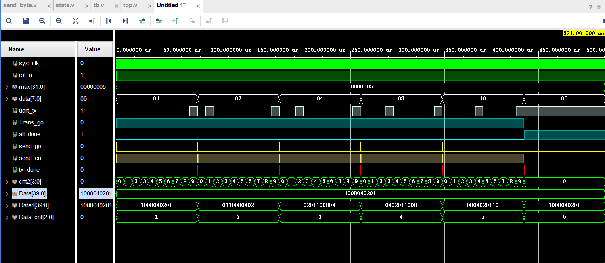

@[toc](用串口发送多bit数据)

# 一、想实现的效果是

当外部给了一个40bit 的数据，FPGA芯片可以用串口把它发给电脑上，或者其他地方，这个我不是很清楚。接收端设备通常是指接收计算机发送的数据的设备。例如，在计算机和FPGA芯片之间进行数据传输时，接收端设备可以是FPGA芯片。

发送端设备通常是指将数据发送给计算机的设备。例如，在计算机和FPGA芯片之间进行数据传输时，发送端设备可以是计算机。

在计算机和FPGA芯片之间进行数据传输时，发送端设备将数据发送到串口，然后通过串口发送协议将数据发送到接收端设备。接收端设备通过串口接收协议接收数据，并将其处理后显示在计算机上。

# 二、实现思路

## 方案一 ：使用多个状态来控制传输

方案一设计思路：比如说要发送40 bit，那我用一个寄存器state当作一个状态变量，来控制不用的状态，进而影响发送什么数据。比如当状态state是0的时候，允许芯片发送Data[7:0]，当状态state是1的时候，允许芯片发送Data[15:8]，当状态state是2的时候，允许芯片发送Data[23:16]......直到state==4，芯片发送数据Data[39：32]。数据全部发完，同时允许state+1 回到空闲状态5，在这个状态，串口不会发送数据。

## 方案二 ：使用两个状态来控制传输

## 1. 设计思想

如果继续通过划分Data来充当做状态的的话，以后发的数据如果不是40位，而是80bit 那Data的位宽需要改动，state的值也要改动，并且state的值还会变得更多，好麻烦呀。
如果发完一组8bit ，不用听从state的指令，而是直接自动地继续发后边的信号，那就好了。又因为在串口模块里，每当8 bit 数据发送完毕就会有一个tx_done信号。只要让
state=0，当tx_done=1的时候，state+1，这样就可以自动地发送后边的信号了。

==具体就是==：

## 2. 端口介绍

* 其中的端口以及变量的含义是：
  * clk：时钟信号
  * rst_n：复位信号
  * max：（参数）待发送的数据的总字节
  * Trans_go:顶层模块的发送使能信号
  * all_done：串口发送所有数据的完成信号
  * send_go：串口发送一组数据的使能信号
  * tx_done：串口发送8bit数据完成信号
  * Data：待发送的数据
  * Data1：将待发送的数据寄存到这里，方便发送
  * Data_cnt：(计数器)，计算发送了多少字节，当发送完max个字节时，发送完成信号all_done拉高
  
## 3. 过程描述
  当rst_n拉低时，Trans_go信号默认为高，当rst_n拉高后，直接进入到发送状态，

# 三、代码

## 1. 方案一代码
